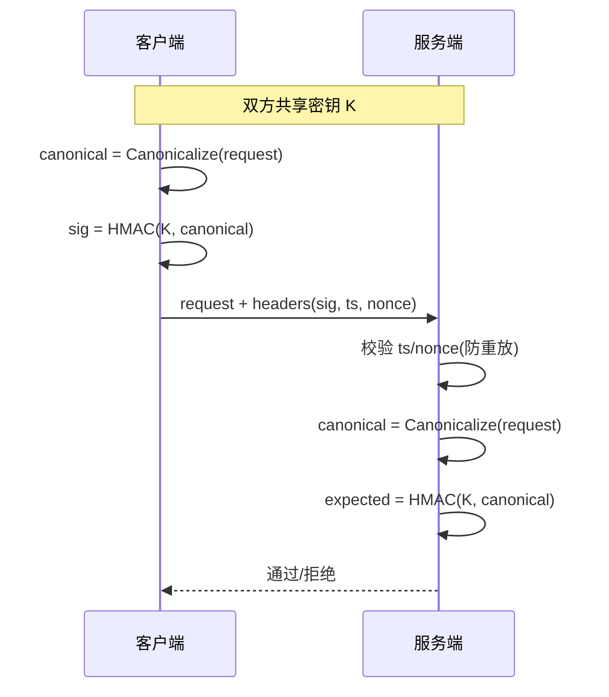

# 网络环境中的签名校验方案：原理、实现与选型（技术文档）

版本：v1.0  
适用范围：服务端/客户端接口请求鉴权、消息总线与事件通知、文件分发与配置下发、第三方回调验真、令牌与会话凭据校验  

---

## 目录

- [1. 背景与术语](#1-背景与术语)
- [2. 主流签名校验方案概述](#2-主流签名校验方案概述)
  - [2.1 基于哈希算法的校验（Checksum/Digest）](#21-基于哈希算法的校验checksumdigest)
  - [2.2 基于 HMAC 的消息认证（对称密钥 MAC）](#22-基于-hmac-的消息认证对称密钥-mac)
  - [2.3 基于非对称密码的数字签名（RSA/ECDSA/EdDSA）](#23-基于非对称密码的数字签名rsaecdsaeddsa)
  - [2.4 基于证书链/PKI 的校验（X.509/mTLS/JWS）](#24-基于证书链pki-的校验x509mtlsjws)
  - [2.5 结构化令牌与标准化签名（JWT/JWS、HTTP Message Signatures、SigV4）](#25-结构化令牌与标准化签名jwtjwshttp-message-signaturessigv4)
- [3. 各方案实现方法详解](#3-各方案实现方法详解)
  - [3.1 哈希校验：完整性证明而非身份认证](#31-哈希校验完整性证明而非身份认证)
  - [3.2 HMAC：共享密钥下的强认证与完整性](#32-hmac共享密钥下的强认证与完整性)
  - [3.3 非对称签名：不可否认与跨域分发](#33-非对称签名不可否认与跨域分发)
  - [3.4 PKI/证书：把公钥绑定到身份](#34-pki证书把公钥绑定到身份)
  - [3.5 典型“网络签名”流程要点（规范化、覆盖范围、防重放）](#35-典型网络签名流程要点规范化覆盖范围防重放)
  - [3.6 标准化签名方案落地（JWT/JWS、HTTP Message Signatures、SigV4）](#36-标准化签名方案落地jwtjwshttp-message-signaturessigv4)
- [4. 关键函数与 API 解析](#4-关键函数与-api-解析)
  - [4.1 哈希与摘要](#41-哈希与摘要)
  - [4.2 HMAC](#42-hmac)
  - [4.3 非对称签名与验签](#43-非对称签名与验签)
  - [4.4 证书与链路校验](#44-证书与链路校验)
  - [4.5 Web/协议标准组件](#45-web协议标准组件)
- [5. 技术对比与选型建议](#5-技术对比与选型建议)
- [6. 最佳实践与安全考量](#6-最佳实践与安全考量)
- [7. 参考文献](#7-参考文献)

---

## 1. 背景与术语

在“当前网络环境”中，签名校验主要解决三类问题：

- **完整性（Integrity）**：消息在传输/存储过程中未被篡改。
- **身份认证（Authentication）**：消息确实来自持有密钥的一方。
- **不可否认（Non-repudiation）**：签名方事后难以否认曾经发送/签署该消息（通常依赖非对称签名与合规密钥管理）。

常用术语：

- **摘要（Digest/Hash）**：对消息做不可逆压缩映射（如 SHA-256）。
- **MAC（Message Authentication Code）**：带密钥的完整性校验（如 HMAC）。
- **数字签名（Digital Signature）**：使用私钥签名、公钥验签（如 RSA-PSS、ECDSA、Ed25519）。
- **规范化（Canonicalization）**：把请求（路径、Query、Headers、Body）转成稳定的“签名字符串”，避免同义不同形导致验签失败。
- **重放攻击（Replay）**：攻击者复用历史合法请求实现越权（需时间戳/nonce/序列号等防护）。

---

## 2. 主流签名校验方案概述

### 2.1 基于哈希算法的校验（Checksum/Digest）

代表：SHA-256/SHA-512、BLAKE2/BLAKE3（工程上也常见 MD5/SHA-1，但已不推荐用于安全用途）。  
核心：对消息 `M` 计算摘要 `H(M)`，接收方重新计算对比。

特点：

- 能检测**随机错误**与**非对抗性篡改**，但在攻击者可控网络中不提供身份认证（攻击者可重算哈希并替换）。
- 常用于**文件分发校验**（配合可信渠道发布 hash）或**内容去重/索引**。

### 2.2 基于 HMAC 的消息认证（对称密钥 MAC）

代表：HMAC-SHA256/HMAC-SHA512。  
核心：双方共享密钥 `K`，计算 `MAC = HMAC(K, M)`。

特点：

- 同时提供**完整性**与**身份认证**（拥有密钥者才能生成正确 MAC）。
- 验证速度快、实现成熟；缺点是**密钥分发与多方授权困难**（共享密钥意味着双方都能“伪造”对方）。

### 2.3 基于非对称密码的数字签名（RSA/ECDSA/EdDSA）

代表：

- RSA：RSASSA-PSS（推荐），RSASSA-PKCS1 v1.5（兼容性常见但更老）。
- ECC：ECDSA（P-256/P-384），EdDSA（Ed25519/Ed448）。

核心：签名方用私钥对消息摘要或消息做签名，接收方用公钥验签。

特点：

- **公钥可公开分发**，便于跨组织/第三方回调/离线验证。
- 更适合“多验证者、少签名者”的场景（例如平台签发令牌、客户端验签）。
- 性能上：Ed25519 通常更快且实现更不易踩坑；RSA 在大验签量下也可接受（依实现而定）。

### 2.4 基于证书链/PKI 的校验（X.509/mTLS/JWS）

代表：TLS 证书链校验、mTLS 双向认证、基于 X.509 的签名者身份绑定。  
核心：用 CA/证书链把“公钥”与“主体身份（域名/组织/设备）”绑定，并通过链路验证/吊销/有效期控制信任。

特点：

- 适合**互联网开放环境**与**跨域信任**，但引入证书管理与 PKI 运维成本（签发、更新、吊销、链路策略）。

### 2.5 结构化令牌与标准化签名（JWT/JWS、HTTP Message Signatures、SigV4）

代表：

- **JWS/JWT**：对 JSON/Claims 签名，广泛用于 SSO、API 鉴权令牌。
- **HTTP Message Signatures（RFC 9421）**：对 HTTP 请求组件（headers、method、authority、path、query、body-digest）签名。
- **AWS Signature V4**：对 Canonical Request + StringToSign 做 HMAC，加入时间戳与 scope，强制防重放与区域化密钥派生。

特点：

- 提供较强的**可互操作性**与“签名覆盖范围”规范，但要严格执行**规范化规则**与**算法/参数约束**。

---

## 3. 各方案实现方法详解

### 3.1 哈希校验：完整性证明而非身份认证

#### 工作流程

```mermaid
flowchart LR
  A[发送方: 消息 M] --> B[计算 digest = H(M)]
  B --> C[发送: M + digest]
  C --> D[接收方: 重新计算 H(M)]
  D --> E{digest 是否一致?}
  E -- 是 --> F[通过]
  E -- 否 --> G[拒绝/告警]
```

#### 实现步骤（通用）

1. 选择哈希算法（安全场景优先 SHA-256/512；避免 MD5/SHA-1）。
2. 明确消息边界（字节序列是什么：编码、换行、压缩、JSON 序列化规则）。
3. 发送端输出 digest（十六进制/Base64）。
4. 接收端对同一字节序列重算并使用常量时间比较（避免侧信道）。

#### 典型应用场景

- 文件下载/镜像分发：把 digest 发布在可信页面/签名清单中。
- 内容寻址：以 digest 作为缓存 key。

#### 优缺点与适用条件

- 优点：实现简单、性能高、无密钥管理负担。
- 缺点：对抗性网络中无法证明“是谁发的”，也无法阻止攻击者篡改后重算 digest。
- 适用：**可信发布渠道**已存在，或只需错误检测。

---

### 3.2 HMAC：共享密钥下的强认证与完整性

#### 工作流程



#### 实现步骤（请求签名通用）

1. **选择签名覆盖范围**：通常至少包含 `method + path + query + headers(如 host、content-type) + bodyDigest + timestamp + nonce`。
2. **规范化**：
   - Query：排序、URL 编码规范统一（空值、重复 key 的处理要固定）。
   - Headers：选择白名单并统一大小写/空白折叠。
   - Body：对原始字节算 digest（或对 canonical JSON 算 digest）。
3. **计算 HMAC**：推荐 HMAC-SHA256。
4. **防重放**：
   - 携带 `timestamp`（秒/毫秒）与 `nonce`（随机串）或 `sequence`。
   - 服务端维护 nonce/sequence 的短期去重窗口（例如 5 分钟）。
5. **验签与时间窗校验**：先验时间窗与 nonce 去重，再验签（或并行），避免放大攻击。

#### 安全机制要点

- HMAC 能抵御“长度扩展攻击”，相比 `hash(secret || msg)` 更安全。
- 使用**常量时间比较**（避免基于比较耗时泄露 MAC 前缀）。

#### 典型应用场景

- 内部服务到服务（S2S）鉴权：高性能、低复杂度。
- 公网开放 API（对合作方发放 appKey/appSecret）：配合严格防重放与限流。
- Webhook 回调验真：平台与商户共享 secret，回调携带 HMAC。

#### 优缺点与适用条件

- 优点：实现简单、验签快；无需公钥基础设施。
- 缺点：共享密钥不利于多方扩展与审计；密钥泄露影响面大。
- 适用：参与方数量有限、能够安全分发与轮换对称密钥。

---

### 3.3 非对称签名：不可否认与跨域分发

#### 工作流程

```mermaid
flowchart LR
  A[签名方: message M] --> B[canonical/摘要]
  B --> C[使用私钥 Sign(sk, data)]
  C --> D[发送: M + signature + keyId/证书]
  D --> E[验签方: 获取公钥 pk]
  E --> F[Verify(pk, data, signature)]
  F --> G{是否有效?}
  G -- 是 --> H[通过]
  G -- 否 --> I[拒绝/告警]
```

#### 实现步骤（通用）

1. **选择算法与参数**：
   - 推荐：Ed25519；或 ECDSA P-256；或 RSA-PSS(2048+).
   - 明确哈希：RSA-PSS 常配 SHA-256；ECDSA 常配 SHA-256。
2. **消息表示与规范化**：与 HMAC 相同，重点在“同一消息必须得到同一签名输入”。
3. **签名格式**：
   - Base64 编码签名值。
   - 携带 `keyId` 或证书指纹/链路信息，用于定位公钥。
4. **公钥分发与信任**：
   - 通过证书链（PKI）、配置下发、硬编码公钥 pinning（谨慎）等方式建立信任。
5. **验签与策略**：
   - 限制允许算法集合（Algorithm Allowlist）。
   - 处理密钥轮换：按 `keyId` 查找对应公钥并支持并行有效期。

#### 典型应用场景

- 第三方回调/Webhook：平台签名，商户用平台公钥验签。
- 离线许可/配置签名：客户端在离线环境验签，防篡改。
- 多方验证：一把私钥签名，多方持公钥验证。

#### 优缺点与适用条件

- 优点：便于分发与审计；可实现不可否认；密钥泄露影响更可控（泄露私钥才致命）。
- 缺点：签名/验签开销通常高于 HMAC；需要公钥信任体系与轮换策略。
- 适用：跨组织、公开环境、需要可审计性与不可否认。

---

### 3.4 PKI/证书：把公钥绑定到身份

#### 典型机制

- **TLS 服务器认证**：客户端验证服务器证书链，确保连接到了正确域名/组织。
- **mTLS 双向认证**：双方都用证书证明身份，适合高安全内网或 B2B 通道。
- **证书绑定的应用层签名**：消息携带证书或证书链，验签方同时校验证书有效性与签名正确性。

#### 实现要点

- 链路校验：校验证书链、域名匹配（SAN）、有效期、吊销策略（CRL/OCSP/Stapling）。
- 签名者识别：从证书中提取主体标识（Subject/SAN/自定义扩展）并映射到业务身份。
- 运维：证书自动化签发与续期（短期证书、自动轮换）、密钥保护（HSM/KMS）。

---

### 3.5 典型“网络签名”流程要点（规范化、覆盖范围、防重放）

在 HTTP API 场景中，最常见问题不是密码学实现，而是“签名输入不一致”与“重放攻击没防住”。

#### 签名输入建议结构

```text
signing_string =
  method + "\n" +
  authority(host) + "\n" +
  path + "\n" +
  canonical_query + "\n" +
  canonical_headers + "\n" +
  body_digest + "\n" +
  timestamp + "\n" +
  nonce
```

#### 防重放建议（至少满足其一，最好组合）

- **timestamp + 窗口**：服务端只接受近 N 秒的请求（例如 300 秒）。
- **nonce 去重**：对每个 clientId/appKey，在窗口内 nonce 必须唯一。
- **序列号/计数器**：要求单调递增（更强，但状态维护成本更高）。
- **一次性令牌**：在关键操作前获取 challenge/token（适合高风险接口）。

---

### 3.6 标准化签名方案落地（JWT/JWS、HTTP Message Signatures、SigV4）

#### 3.6.1 JWT/JWS：令牌签名的“验签 + Claims 校验”

JWT（JWS Compact Serialization）典型结构为：

```text
base64url(header) + "." + base64url(payload) + "." + base64url(signature)
```

验签要点：

1. 解码 `header/payload`（Base64URL），拒绝非预期结构与过大载荷。
2. 只允许服务端配置的算法集合（例如仅 `RS256` 或仅 `EdDSA`），不要相信来路的 `alg`。
3. 依据 `kid` 在本地 keyset 中定位公钥（或证书），并做签名验证。
4. 在签名通过后，校验 Claims：
   - `exp/nbf/iat`（过期、未生效、签发时间与时钟偏差）
   - `iss/aud/sub`（签发者、受众、主体）
   - `jti`（如需防重放，可将 `jti` 作为 nonce 在窗口内去重）

常见错误：

- 只验签不验 `exp/aud/iss`，导致“过期 token 仍可用”“跨系统 token 误用”。
- `kid` 可控导致 key confusion（应限定 `kid` 取值集合，并与租户/系统边界绑定）。

#### 3.6.2 HTTP Message Signatures（RFC 9421）：把 HTTP 组件变成可验证对象

该方案把签名输入定义为一组 HTTP 组件（方法、authority、path、选定 headers、内容摘要等）以及签名参数（`created/expires`）。核心落地要点：

- 组件选择：建议覆盖 `@method`、`@authority`、`@path`、`content-digest`、`content-type`、`date/created` 等。
- 时间与有效期：强烈建议使用 `created/expires` 并在服务端限制窗口。
- key 选择：`keyid` 指向可查询的公钥/证书；验签方必须对 `keyid` 做访问控制与白名单约束。

示意（概念性，非完整格式）：

```text
Signature-Input: sig1=("@method" "@authority" "@path" "content-digest");created=1700000000;expires=1700000300;keyid="k1"
Signature: sig1=:base64(signatureBytes):
```

#### 3.6.3 AWS SigV4：HMAC 规范化请求的工程化范式

SigV4 的关键价值在于把“规范化 + 防重放 + 密钥派生”形成固定模板，适用于大规模开放 API。

核心步骤（抽象化）：

1. CanonicalRequest：
   - `HTTPMethod`
   - `CanonicalURI`
   - `CanonicalQueryString`
   - `CanonicalHeaders` + `SignedHeaders`
   - `HashedPayload`（可选用特殊值表示未签 body，但需谨慎）
2. StringToSign：加入 `timestamp`、`scope(日期/区域/服务)`、`hash(CanonicalRequest)`。
3. 派生 signing key：`KDate -> KRegion -> KService -> KSigning`，降低长期密钥直接暴露风险。
4. 计算签名：`HMAC(signingKey, StringToSign)`；服务端同样计算并对比。

落地注意：

- 强制时钟偏差控制与拒绝过旧请求。
- Query 与 Header 的规范化必须严格一致（编码、排序、空值处理）。
- 限制 `SignedHeaders` 集合，避免签名覆盖不足或被攻击者添加同名 header 混淆。

---

## 4. 关键函数与 API 解析

本节按“方案 → 常用组件”列出核心函数/接口，重点说明入参、输出与常见调用方式。示例以“概念性 API”呈现，便于映射到具体语言/平台。

### 4.1 哈希与摘要

#### 通用概念函数

- `Digest(algorithm, bytes) -> digestBytes`
  - `algorithm`：`SHA-256`/`SHA-512` 等
  - `bytes`：待计算摘要的原始字节
  - 返回：固定长度摘要字节

#### 常见实现（跨语言对应）

- OpenSSL（命令行/库）：
  - 命令：`openssl dgst -sha256 <file>`
  - 库：`EVP_DigestInit_ex / EVP_DigestUpdate / EVP_DigestFinal_ex`
- Java（JCA）：
  - `java.security.MessageDigest.getInstance("SHA-256")`
  - `update(byte[])` + `digest()`
- Go：
  - `crypto/sha256.Sum256(data)`
  - 或 `hash.Hash` 流式 `Write` + `Sum(nil)`
- Node.js：
  - `crypto.createHash('sha256').update(data).digest('base64')`
- Python：
  - `hashlib.sha256(data).digest()` / `.hexdigest()`

### 4.2 HMAC

#### 通用概念函数

- `HMAC(algorithm, keyBytes, messageBytes) -> macBytes`
  - `algorithm`：通常 `SHA-256`
  - `keyBytes`：共享密钥（原始字节，不要用可预测短字符串）
  - `messageBytes`：规范化后的签名输入
  - 返回：MAC 字节

#### 常见实现（跨语言对应）

- OpenSSL：
  - `HMAC(EVP_sha256(), key, keyLen, data, dataLen, out, &outLen)`
- Java（JCA）：
  - `Mac.getInstance("HmacSHA256")`
  - `init(SecretKeySpec(key, "HmacSHA256"))`
  - `doFinal(data)`
- Go：
  - `hmac.New(sha256.New, key)` + `Write(data)` + `Sum(nil)`
- Node.js：
  - `crypto.createHmac('sha256', key).update(data).digest('hex')`
- Python：
  - `hmac.new(key, data, hashlib.sha256).digest()`

#### 校验注意事项

- 使用常量时间比较：例如 Go `hmac.Equal(a, b)`；Node 可用 `crypto.timingSafeEqual`；Java 需避免 `Arrays.equals` 的时序差异（可使用专门实现）。

### 4.3 非对称签名与验签

#### 通用概念函数

- `Sign(algorithm, privateKey, messageBytes) -> signatureBytes`
- `Verify(algorithm, publicKey, messageBytes, signatureBytes) -> bool`

关键参数解释：

- `algorithm`：明确到“签名方案 + 哈希/编码”，例如：
  - `RSASSA-PSS(SHA-256, saltLen=32)`
  - `ECDSA(P-256, SHA-256)`
  - `Ed25519`（内部定义哈希与编码规则）
- `messageBytes`：通常是 canonical request 或其摘要（取决于库 API 与协议约定）

#### OpenSSL 示例（RSA-PSS 验签，示意）

```bash
# data.txt 是签名输入，sig.bin 是原始签名字节（非 base64）
openssl dgst -sha256 -verify pubkey.pem \
  -sigopt rsa_padding_mode:pss -sigopt rsa_pss_saltlen:-1 \
  -signature sig.bin data.txt
```

#### Java（JCA/JCE）示例（ECDSA）

```java
Signature verifier = Signature.getInstance("SHA256withECDSA");
verifier.initVerify(publicKey);
verifier.update(messageBytes);
boolean ok = verifier.verify(signatureBytes);
```

#### Go 示例（Ed25519）

```go
ok := ed25519.Verify(publicKey, messageBytes, signatureBytes)
```

#### 典型安全坑

- ECDSA 需要安全随机 `k`（否则可泄露私钥）；优先使用成熟库并避免自实现。
- 验签必须限制算法与参数，避免“算法降级/混淆”（例如把 `alg=none` 当作合法）。

### 4.4 证书与链路校验

#### 核心组件

- X.509 证书解析：读取 Subject、SAN、KeyUsage、ExtendedKeyUsage。
- 证书链验证：根证书/中间证书、路径构建、策略约束。
- 吊销与有效性：CRL、OCSP、OCSP Stapling（TLS）。

#### 常见 API（概念映射）

- OpenSSL：`X509_verify_cert`、`X509_STORE`、`X509_STORE_CTX`
- Java：`CertPathValidator`、`TrustManagerFactory`、`X509TrustManager`
- Go：`crypto/x509` 的 `Verify`、`CertPool`

### 4.5 Web/协议标准组件

- **JWS/JWT**：
  - 关键点：Header 的 `alg/kid/typ`，Payload 的 `iss/aud/exp/nbf/iat/jti`。
  - 校验：签名正确性 + Claims 校验（过期、受众、签发者）。
- **HTTP Message Signatures（RFC 9421）**：
  - 关键点：签名覆盖哪些组件、`created/expires`、签名参数化与 `keyid`。
- **AWS SigV4**：
  - 关键点：CanonicalRequest、StringToSign、派生密钥（日期/区域/服务）与时钟偏差控制。

---

## 5. 技术对比与选型建议

### 5.1 对比表

| 方案 | 认证能力 | 完整性 | 不可否认 | 性能 | 密钥/信任管理 | 典型兼容性 | 推荐场景 |
|---|---|---|---|---|---|---|---|
| 哈希摘要（SHA-256） | 否 | 是 | 否 | 很高 | 无 | 极高 | 文件校验、去重、缓存 |
| HMAC（HMAC-SHA256） | 是（共享密钥） | 是 | 否（双方可伪造） | 很高 | 共享密钥分发/轮换 | 极高 | 内网 S2S、Webhook、开放 API（少合作方） |
| 非对称签名（Ed25519/ECDSA/RSA-PSS） | 是（私钥持有） | 是 | 是（配合合规管理） | 中-高 | 公钥分发/证书体系 | 高（视算法） | 多验签方、第三方回调、离线验签 |
| PKI/证书（TLS/mTLS） | 是（证书身份） | 是（链路级） | 间接支持 | 高 | 证书签发/吊销/续期 | 极高 | 公网通信、B2B 专线、零信任 |
| 标准化签名（JWS/HTTP Signatures/SigV4） | 是 | 是 | 取决于算法 | 中-高 | 与所用算法一致 | 高 | 跨系统互操作、规范化请求签名 |

### 5.2 选型建议（按业务场景）

- **下载包/配置文件防篡改（可离线校验）**：优先非对称签名（Ed25519/ECDSA），客户端内置或可信获取公钥/证书。
- **内部微服务调用**：优先 HMAC（实现与性能最好），配合 mTLS 作为传输层安全。
- **第三方回调/Webhook**：优先非对称签名（平台私钥签名、商户公钥验签）；若合作方成熟度不一可提供 HMAC 兼容方案。
- **用户态令牌与 SSO**：优先 JWT/JWS（标准 claims + key rotation + kid），严禁接受不可信 `alg`。
- **高风险资金/权限操作**：在应用层签名之外叠加防重放（nonce/序列号）、二次确认、风控与强绑定（设备/会话）。

---

## 6. 最佳实践与安全考量

### 6.1 密钥管理

- **密钥分级**：根密钥用于派生/签发；业务密钥可轮换且最小权限使用。
- **存储与使用**：服务端优先 KMS/HSM；客户端避免明文硬编码密钥（对称密钥尤其危险）。
- **轮换策略**：
  - 引入 `kid/keyId`，支持新旧密钥并行验证窗口。
  - 设定到期时间与自动轮换流程；保留撤销与紧急停用机制。

### 6.2 防重放攻击

- 时间戳窗口校验（处理时钟偏差：可允许小范围 skew）。
- nonce 去重（按 clientId/appKey 分桶存储；容量与过期策略清晰）。
- 对关键接口使用序列号或一次性 token（强一致性需求更高）。

### 6.3 签名覆盖范围与规范化

- 覆盖关键字段：`method/path/query/host/content-type/bodyDigest/timestamp/nonce`。
- 避免“只签部分字段”导致中间人篡改未签字段（例如金额、收款账号必须签入）。
- 规范化必须可复现：明确字符集（UTF-8）、换行（LF）、URL 编码规则、JSON 序列化规则（字段排序、空值处理）。

### 6.4 算法与实现安全

- 禁用不安全算法：MD5/SHA-1 用于安全签名不推荐；RSA 旧填充方案慎用，优先 RSA-PSS。
- 使用成熟库，避免自实现密码学；启用算法白名单与参数校验。
- 常量时间比较：MAC/签名比对使用 timing-safe 方法。
- 避免信息泄露：验签失败返回统一错误；日志不记录 secret/私钥/原始签名输入的敏感部分。

### 6.5 传输层与应用层的关系

- TLS/mTLS 解决链路机密性与对端身份；应用层签名解决“消息级”可审计、可转发、可离线验证等需求。
- 在公网场景通常建议“两层叠加”：**TLS + 应用层签名**（尤其是回调、转发、异步消息）。

---

## 7. 参考文献

- RFC 2104: HMAC: Keyed-Hashing for Message Authentication
- FIPS 180-4: Secure Hash Standard (SHS)
- RFC 8017: PKCS #1: RSA Cryptography Specifications
- RFC 8032: Edwards-Curve Digital Signature Algorithm (EdDSA)
- FIPS 186-5: Digital Signature Standard (DSS)
- RFC 7515: JSON Web Signature (JWS)
- RFC 7519: JSON Web Token (JWT)
- RFC 9421: HTTP Message Signatures
- RFC 5849: The OAuth 1.0 Protocol
- NIST SP 800-57: Recommendation for Key Management
- NIST SP 800-131A: Transitioning the Use of Cryptographic Algorithms and Key Lengths
- AWS Documentation: Signature Version 4 Signing Process
